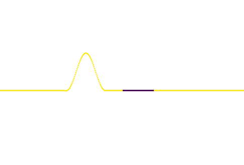

# wave_simulation

This plots waves travelling through space where the wave-speed is different at each point. 

For example, here we see an incoming light wave starting at a region (yellow) with fast wave-speed (e.g., air) entering a region (blue) with slower wave-speed (e.g., glass) and then re-entering the original medium (air). Notice the reflection and refraction. 



## How to run the demo.

Run `timestepping_test.py` and use that as a template on how to construct your own examples. Let us walk through that example:

First, set an initial condition for the wave:
```
def wave_init(x):
    if -3*math.pi < x < - math.pi:
        return math.cos(x) + 1
    else:
        return 0

```

Thus initially the wave is a bump that is equal to 0 everywhere except for the interval $[-3\pi, -\pi]$, where it is cos(x) + 1. 

Also need to set the initial first derivative w.r.t time:

```
def wave_deriv_init(x):
    if -3*math.pi < x < - math.pi:
        return math.sin(x)
    else:
        return 0
```

This was engineered so that the wave moves right initially.

Now set the wave speed function:

```
def wave_speed_func(x):
    if x < 0.0:
        return 1.0
    elif 0.0<=x<5.0:
        return 0.5
    else:
        return 1.0

```

This means that the wave speed will be $0.5$ in the region $0 \leq x \leq 5$ and it will be $1$ for $x<0$ and $x>5$.

Now create the simulation object by supplying these functions to the constructor (along with some other parameters):

```wave_sim = WaveSimulation(wave_init, wave_deriv_init, wave_speed_func,
        delta_x, delta_t, x_lower, x_upper)
```

Now `wave_sim.wave` accesses the wave values at the current time, while the method `wave_sim.iterate()` will update the wave by one time-step (of duration `delta_t`) using the finite difference method.
